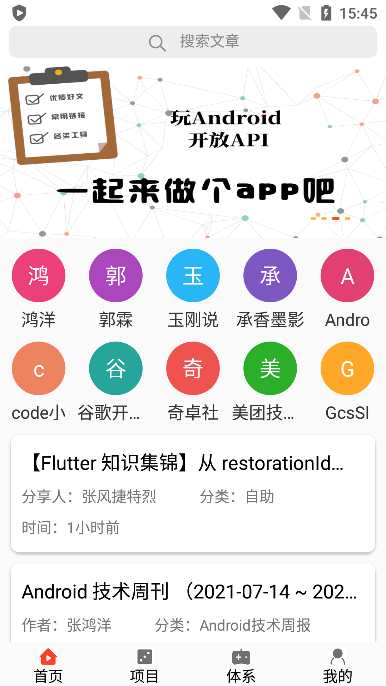
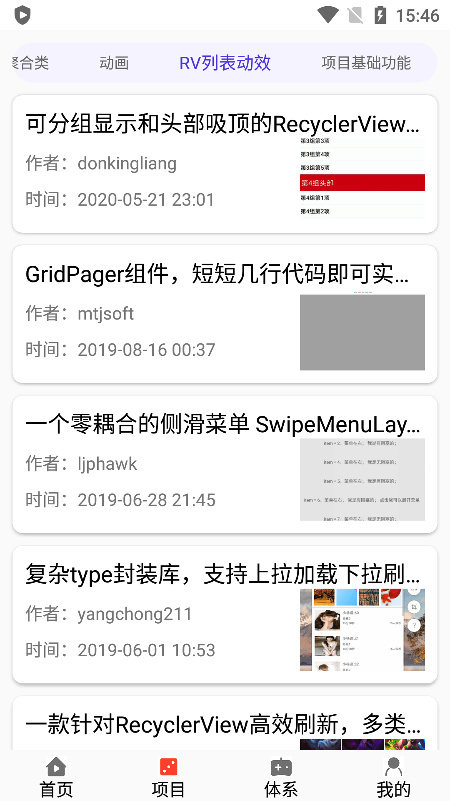
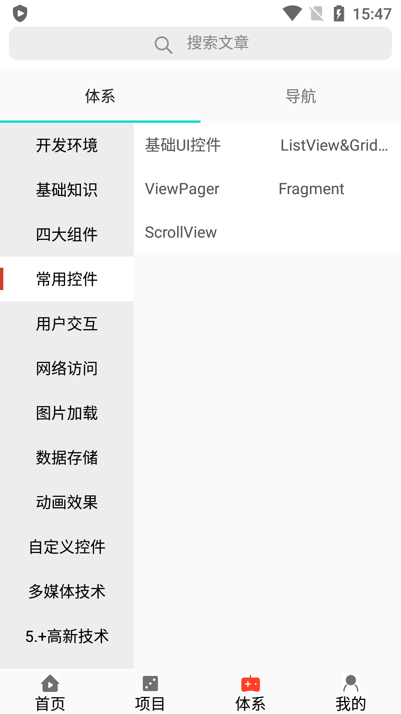
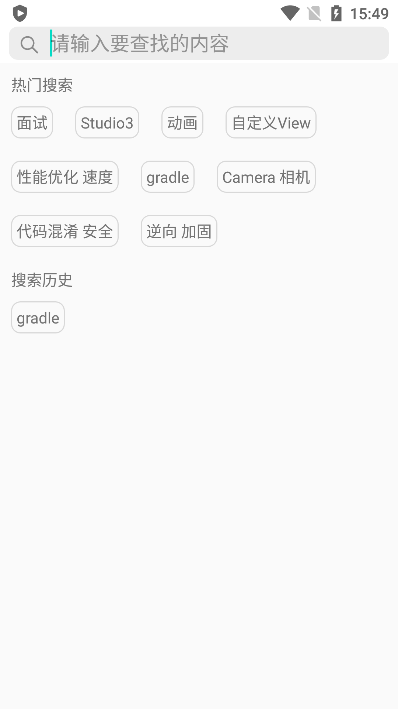
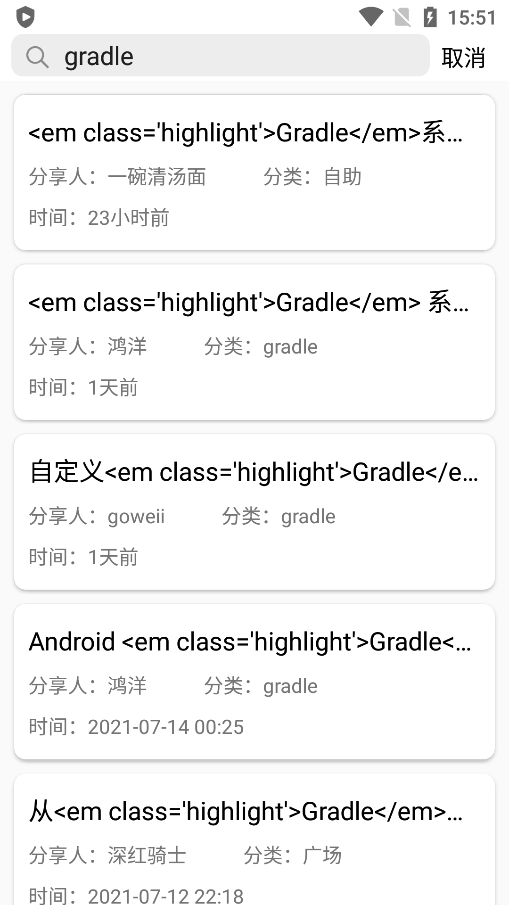

<h1 align ="center">WanAndroid-MVVM</h1>

### 快速打造一款体验良好的Android客户端，最初版为java，现项目为混写版本，层次结构分明，注解清晰。项目稳定性以及UI相对初始版本已有较大提高。如果你还觉得不错的话，就点个Star吧（项目持续升级中）

## 介绍

WanAndroid项目架构基于Material Design + ViewModel+ViewBinding+Rxhttp+Room+Glide相比于MVP模式减少多余代码，封装了ViewModel和ViewBinding,解耦行更高。团队开发成本低快速上手，清晰易懂。

## 预览图

## 技能点
- 项目尽力遵循阿里巴巴Android开发规范，并有良好的注释
- 使用Rxhttp进行网络请求，团队开发成本很低，封装了okhttp及rxjava
- 减少多余代码用lamda表达式
- 封装ViewModel使得可以一对一变成多对一，多对多
- 废弃kotlin-extension，buttknife，封装viewbinding进行ID查找
- 使用room数据库，更高效更安全
- 使用lifecycle对生命周期进行管理
- 使用SmartRefreshLayout丰富的刷新动画提升项目美感
- 查看更多请clone

## 版本

### v1.0.0
1.主界面框架搭建

2.头布局banner添加

3.公众号列表

4.UI的美化

5.提交第一版

### v1.0.1
1."项目"模块搭建

2.优化搜索框

3.搜索热词显示

### v1.1.0
1.导航栏页面完成

2.增加发车模块（干货集中营API）

3.清除缓存功能

### v1.2.0
1.导航栏双极联动

2.解决数据库升级问题

3.利用线程池数据库查找刷新

### v1.3.0
1.废弃butterknifer以及kotlin-extension

2.封装viewbinding查找ID

### v1.4.0
1.今日头条全面适配UI

2.优化tablayout显示效果

3.view模块java全面变为kotlin

### v1.5.0
1.首页增加搜索栏

2.增加登录注册页面

3.解决子线程查询数据库view刷新崩溃bug

4.gradle统一依赖配置

## 感谢

### 鸿洋大神提供的

[WanAndroid API](http://www.wanandroid.com/blog/show/2)

### 干货集中营

[Meizi API](https://gank.io/)

### Rxhttp最优雅的网络请求封装

[Rxhttp](https://github.com/liujingxing/rxhttp)

#### Image Loader

[Glide](https://github.com/bumptech/glide)

#### UI

[SmartRefreshLayout](https://github.com/scwang90/SmartRefreshLayout)
[阿里巴巴矢量图库](https://www.iconfont.cn/)

## About me
- 欢迎大家加我QQ 283006603
- email:283006603@gmail.com
- 简书[https://www.jianshu.com/u/f19974c98abc](https://www.jianshu.com/u/f19974c98abc)
